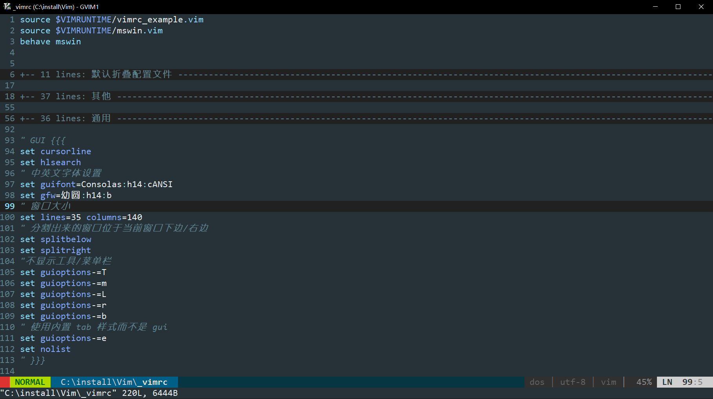

# NekoGVIM

可能是 Windows 上最好的 GVIM 配置，新手也能快速上手使用。

## 背景

编辑器之神 GVIM 是一款完美的文本编辑器，但是它的配置却相当复杂，初始配置非常糟糕。

本项目分享了个人自用的配置文件和一些插件，目的是减少软件配置的时间，让使用者能专注软件本身，提高使用体验。

## 效果

## 使用方法

直接官网下载替换配置文件或是克隆本项目，选择下面的一种方式完成。

**第一次使用请更改配置文件中的 `cd ~` 路径，不然打开不存在的路径会报错，其他根据个人需求去更改。**

1. 官网下载 [GVIM](https://www.vim.org/download.php) 并安装。  
将本项目中以下文件拷贝到软件的对应位置：
`.\Vim\vim82\autoload\pathogen.vim`  
`.\Vim\vim82\bundle`   
`.\Vim\_vimrc`

2. 下载解压本项目，直接运行二进制文件 `.\Vim\vim82\gvim.exe`，目前版本 8.2.1258；

## 部分配置说明

配置文件 `.\Vim\_vimrc` 中有详细说明，配置了舒适的 ui、添加了一些插件、设置了一些快捷键映射等。

安装了插件 AutoComplPop、nerdtree、vim-markdown 等。

部分快捷键：

[F4] 生成头部注释  
[CTRL-N] 生成目录树  
将 ESC 键映射为 jk 键                                      
...
